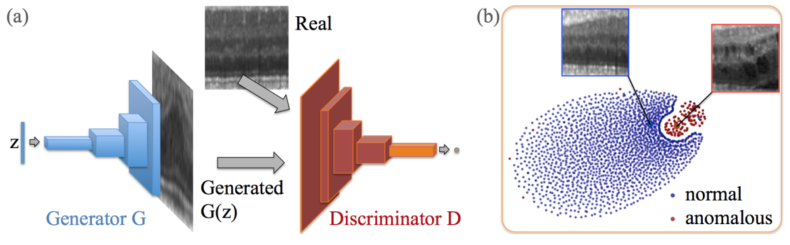
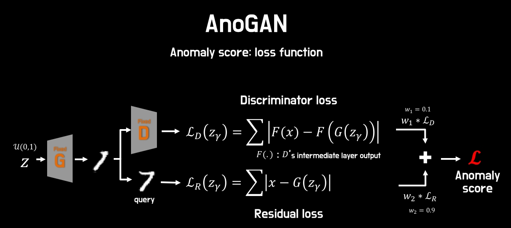

# AnoGAN-pytorch
Pytorch implementation of "Unsupervised Anomaly Detection with Generative Adversarial Networks to Guide Marker Discovery".<br>
Official Paper: https://arxiv.org/pdf/1703.05921.pdf <br>


# What is AnoGAN?

AnoGAN is a [deep convolutional generative adversarial network](https://arxiv.org/pdf/1703.05921.pdf) to learn a manifold of normal anatomical variability, accompanying a novel anomaly scoring scheme based on the mapping from image space to a latent space.<br>

<br>
This paper aims to find a point **z** in the latent space that corresponds to an image *G*(**z**) that is visually most similar to query image **x** and that is located on the manifold ***X***.<br>

## Brief Summary of AnoGAN 
1. Train **[DCGAN](https://arxiv.org/pdf/1703.05921.pdf)** with solely on image data of **healthy cases** with the aim to model the variety of healthy appearance.
2. Map new images to the *latent space* and find the most similar image *G*(**z**) via applying backpropagation iteratively.
3. Compute Anomaly score *A*(**x**) which is a weighted sum of *residual loss* and *discrimination loss*.

## Loss Functions of AnoGAN : Anomaly_Score = (1-__lambda__) * Residual Loss + __lambda__ * Discrimination_Loss

The Total Loss to find latent variable **z** is defined by a weighted sum of *Residual Loss* and *Discrimination Loss*.

- Residual Loss : Measures L1 distance of the **visual similarity** between qeury image and generated image in the image space.

- Discrimination Loss : Measures L1 distance of the **feature similarity** between qeury image and generated image in the feature representation of the discriminator.(Enforces the generated image to lie on the manifold by using the trained discriminator not as classifier, but as a **feature extractor**)

```python
def residual_loss(x,G_z):
  return torch.sum(torch.abs(x - G_z))

def discrimination_loss(x,z,D,G):
  feature_G_z , _ = D(G(z))
  feature_x , _ = D(x)
  return torch.sum(torch.abs( feature_x - feature_G_z))
  
def anomaly_score(r_loss, d_loss , __lambda__ = 0.1):
  return (1 - __lambda__) * r_loss + __lambda__ * d_loss
```

# References
- [Unsupervised Anomaly Detection with Generative Adversarial Networks to Guide Marker Discovery](https://arxiv.org/pdf/1703.05921.pdf)
- [Unsupervised Representation Learning with Deep Convolutional Generative Adversarial Networks](https://arxiv.org/abs/1511.06434)
- https://github.com/GunhoChoi/AnoGAN-Pytorch
- https://github.com/seokinj/anoGAN
- https://github.com/tkwoo/anogan-keras
- http://incredible.ai/deep-learning/2018/02/17/AnoGAN/
